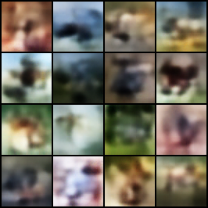

# DiT Diffusion Transformer for Face Generation

This project implements a Diffusion Transformer (DiT) model trained on CIFAR-10 latents

## Generated Samples

The model was trained for 15 epochs using a DiT architecture with latent diffusion on compressed VAE representations of CIFAR-10 images.
